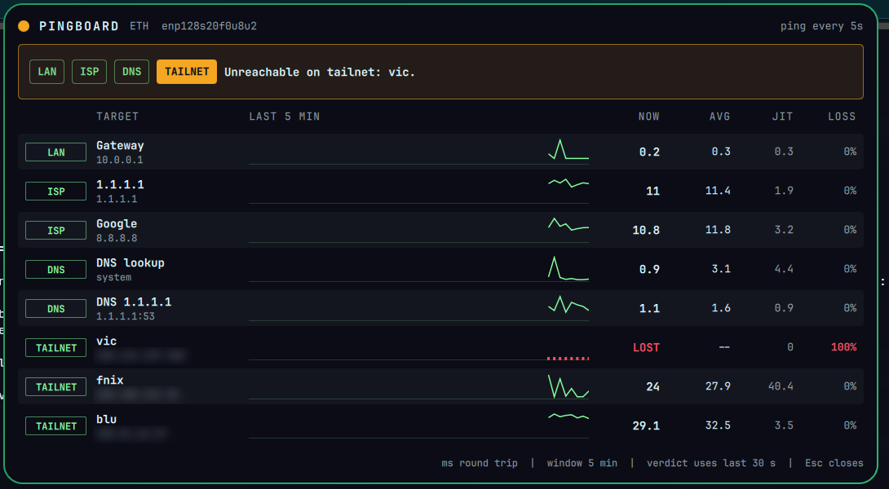
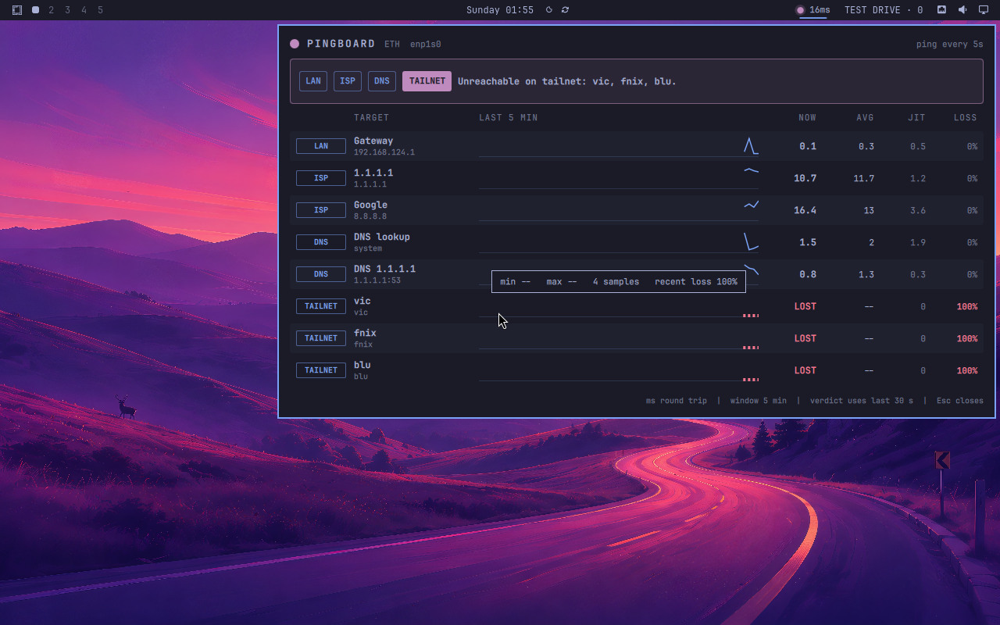

# Pingboard

An Omarchy bar plugin that answers the daily question: **is it me, the router, the ISP, DNS, or the tailnet?**

A dot and the internet round trip sit on the bar. Click it for live latency, jitter and loss to every hop that matters, with a one-line verdict that names where the problem is.




*Live on a 5120x1440 desktop. Tailnet addresses blurred.*



*Test Drive VM with no tailnet, so the verdict correctly points at TAILNET.*

## What it probes

| Tag | Target | Proves |
|---|---|---|
| LAN | default gateway, read from `ip route` (lowest metric) | wifi / cable / router |
| ISP | 1.1.1.1 and 8.8.8.8, by address | upstream path, independent of DNS |
| DNS | system resolver lookup, and a raw UDP query to 1.1.1.1 | name resolution |
| TAILNET | your tailnet hosts (default `vic,fnix,blu`), resolved once via `tailscale ip` | Tailscale peers |

One probe per target every 5 s (configurable 2 to 60 s). Uses `fping` when present, otherwise `ping`. Traffic is roughly 0.2 KB/s.

## Verdict

Looks at the last 30 s: gateway dead means **LAN**; gateway fine but both public IPs dead means **ISP**; IPs fine but lookups fail means **DNS**; everything else fine but a peer is down means **TAILNET**. Loss over 15% or slow averages give a degraded (warn) verdict for the same zones.

## Panel

Everything fits on one screen. The target list is a bounded box that only scrolls in place once you watch more than ten targets. Hover a column head, row tag or sparkline for detail. Colours follow the active Omarchy theme: accent is healthy. Degraded is a fixed amber and down is a fixed red, because some themes map their "red" to green.

## Install

```bash
git clone https://github.com/nixfred/pingboard.omarchy
mkdir -p ~/.config/omarchy/plugins/nixfred.pingboard
cp pingboard.omarchy/{manifest.json,Service.qml,BarWidget.qml,PingPanel.qml,pingboard.py} ~/.config/omarchy/plugins/nixfred.pingboard/
omarchy-shell shell rescanPlugins
omarchy plugin enable nixfred.pingboard right
omarchy restart shell
```

Requires `python3` (standard library only) and `iproute2`. `tailscale` is optional.

Open the panel from a script: `omarchy-shell nixfred.pingboard toggle`.
Test the backend alone: `python3 pingboard.py --once`.

## Settings

| Key | Default | |
|---|---|---|
| `intervalSec` | 5 | seconds between probes |
| `tailnetHosts` | `vic,fnix,blu` | comma-separated tailnet machine names |
| `showMs` | true | ms beside the bar dot |

## License

MIT
